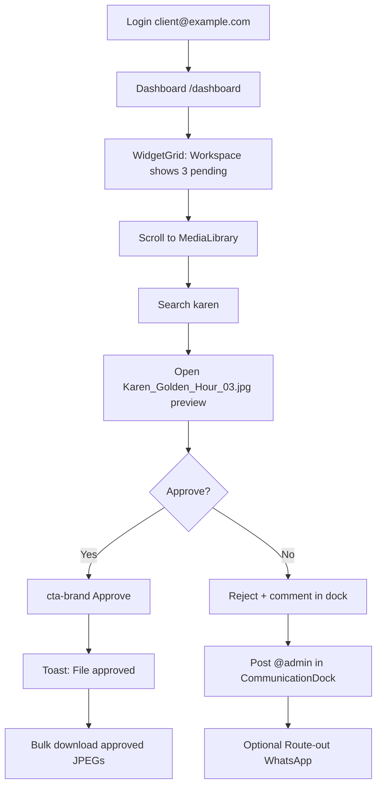

# 316 Studios — UI/UX Technical Specification (v2.0 Redesign)

**Audience:** Frontend engineering  
**Scope:** Visual architecture, layout, components, interaction patterns, and client-side routing only (no backend, AI, or mail/SMS provider logic)  
**Baseline codebase:** React 19 + Vite + Tailwind v4 — routes in `src/AppRoutes.tsx`, client hub in `src/pages/DashboardPage.tsx`, media in `src/components/ui/FileBrowser.tsx`, requests in `src/components/widgets/CollaborationWidget.tsx`  
**Redesign goal:** Replace the current luxury-gold / sharp-rectangle aesthetic with a **high-density, edge-to-edge, glass-forward, color-rich** system featuring **highlighted CTAs**, **editorial masonry grids**, and **unified media + communication surfaces**.

---

## 0. Executive summary

| Area | Current (`v1`) | Target (`v2`) |
|------|----------------|---------------|
| Layout | `max-w-7xl` gutters (`px-6`–`px-14`) | Full-bleed shell; content in `max-w-[1920px]` with `px-3`–`px-5` only |
| Surfaces | Flat `#0d0d0d` panels | Layered glass (`backdrop-blur-xl`, tinted borders, inner glow on focus) |
| Accent | Single gold `#d4af37` | **Triad:** Champagne gold (brand), Magenta flare (CTA/highlight), Cyan ice (info/links) |
| Media | `FileBrowser` grid + list; admin native `<input type="file">` | **`MediaIngestPanel`** — dual optional upload + URL; **`MediaLibrary`** with Send for restricted rows |
| Comms | Per-file comment threads; widget form for requests | **`CommunicationDock`** — persistent hub: in-app thread + **route-out** to WhatsApp / Phone / Email |
| Illustration grids | 6-thumb `MediaWidget`, uniform cards | **Masonry + hero tiles** on marketing; **dense 4–8 col** deliverable grid |

---

## 1. Design system (v2)

### 1.1 Color palette

```css
/* Dark (default) — add to src/index.css :root */
--bg-deep: #030306;
--bg: #07070c;
--surface: rgba(14, 14, 22, 0.72);      /* glass base */
--elevated: rgba(22, 22, 34, 0.85);
--text-primary: #f4f4f8;
--text-secondary: #9b9bb0;
--accent-brand: #e8c547;                  /* champagne gold — brand */
--accent-cta: #ff3d8a;                    /* magenta flare — primary actions */
--accent-cta-hover: #ff6aa8;
--accent-link: #4dd4ff;                   /* cyan ice — links, live badge */
--accent-success: #34d399;
--accent-warning: #fbbf24;
--accent-danger: #f87171;
--glass-fill: rgba(12, 12, 20, 0.55);
--glass-border: rgba(255, 255, 255, 0.12);
--glass-highlight: rgba(255, 255, 255, 0.06);
--glow-cta: 0 0 24px rgba(255, 61, 138, 0.45);
--glow-brand: 0 0 20px rgba(232, 197, 71, 0.25);
```

Light theme preserves the triad; surfaces flip to `rgba(255,255,255,0.75)` with `--bg: #f2f2f8`.

### 1.2 Typography

| Token | Value | Usage |
|-------|-------|--------|
| `--font-display` | `"Inter", sans-serif` weight 900 | Page titles: `DASHBOARD`, `MEDIA LIBRARY` |
| `--font-ui` | Inter 400–600 | Body, tables, chat |
| Eyebrow | `10px / 0.32em tracking / uppercase / accent-brand` | Section labels: `CLIENT WORKSPACE` |
| Metric | `tabular-nums / font-semibold` | `KES 15,000`, file sizes `4.2 MB` |

### 1.3 Spacing & grid

- **Base unit:** 4px (`--space-1` … `--space-20` — keep existing scale).
- **App shell grid:** 24 columns, `gap-2` (8px), `padding-inline: 12px` (mobile) → `20px` (desktop).
- **Dashboard zones:**  
  - Row 1: `span 16` main + `span 8` communication dock (≥1280px)  
  - Row 2: full-width `MediaIngestPanel`  
  - Row 3: full-width `MediaLibrary`  
- **Marketing bento:** CSS `grid-template-columns: repeat(12, 1fr)` with spans `7+5`, `4+4+4`, `8+4` (see §4.3).

### 1.4 Glass surfaces

```css
.glass-panel-v2 {
  background: var(--glass-fill);
  border: 1px solid var(--glass-border);
  backdrop-filter: blur(20px) saturate(1.4);
  box-shadow:
    inset 0 1px 0 var(--glass-highlight),
    0 8px 32px rgba(0, 0, 0, 0.35);
}
.glass-panel-v2--elevated {
  background: var(--elevated);
  border-color: rgba(232, 197, 71, 0.22);
}
```

Apply to: `Navbar`, widget shells, `CommunicationDock`, `MediaIngestPanel`, modals, mobile bottom nav.

### 1.5 Buttons (highlighted CTAs)

| Variant | Visual | Example label |
|---------|--------|----------------|
| `cta-primary` | `bg-accent-cta` + `box-shadow: var(--glow-cta)` + `rounded-lg` | `Send to studio`, `Submit request` |
| `cta-brand` | Gold fill + subtle gold glow | `Approve selection` |
| `ghost-glass` | Transparent on glass, border `glass-border` | `Cancel` |
| `route-whatsapp` | `#25D366` icon chip + outline | `WhatsApp` |
| `route-phone` | `accent-link` border | `+254 700 316 316` |
| `route-email` | `mailto:` trigger | `info@316studios.co.ke` |

**Rule:** One `cta-primary` per viewport zone; secondary actions use `ghost-glass`.

### 1.6 Motion

- Easing: `cubic-bezier(0.16, 1, 0.3, 1)` (keep `src/lib/motion.ts`).
- Grid tile hover: `scale(1.02)` + border brighten (150ms).
- Dock expand: height `280px → 480px` (280ms).
- Respect `prefers-reduced-motion` (existing).

---

## 2. Application architecture (frontend)

### 2.1 Route map (unchanged paths, new shells)

| Route | Page component | v2 layout shell |
|-------|----------------|-----------------|
| `/` | `LandingPage` | `MarketingShell` — edge-to-edge hero + masonry |
| `/dashboard` | `DashboardPage` | `WorkspaceShell` — dock + ingest + library |
| `/projects`, `/projects/:id` | Gallery pages | `GalleryShell` — immersive grid |
| `/contact` | `ContactPage` | Embeds `CommunicationDock` (collapsed) |
| `/admin/users/:id/media` | `AdminClientMediaPage` | `AdminMediaShell` — ingest + table |

### 2.2 Component hierarchy (client workspace)

```
DashboardPage
├── WorkspaceShell (full-bleed, pt-[nav-height])
│   ├── WorkspaceHeader
│   │   ├── Eyebrow: "CLIENT WORKSPACE"
│   │   ├── Title: "John Doe" (from AuthContext)
│   │   └── LiveBadge (Socket connected)
│   ├── WidgetGrid (12-col, draggable — retain useWidgets)
│   │   └── WidgetShell → glass-panel-v2
│   ├── CommunicationDock ★ NEW (sticky right on xl, bottom sheet on mobile)
│   ├── MediaIngestPanel ★ NEW (replaces expanded CollaborationWidget form)
│   └── MediaLibrary ★ REFACTOR (evolve FileBrowser)
│       ├── LibraryToolbar
│       ├── FileGrid | FileList
│       └── FilePreviewModal (evolve MediaPreview)
└── MobileBottomNav (glass, accent dot on Library)
```

### 2.3 New / refactored components

| Component | Replaces / extends | Responsibility |
|-----------|-------------------|----------------|
| `MediaIngestPanel` | `CollaborationWidget` form + admin file input | Dual-path ingest (§3) |
| `MediaLibrary` | `FileBrowser` | Grid/list, approval, comments entry, **Send** on restricted |
| `CommunicationDock` | scattered comments + contact | Hub UI + route-out (§4) |
| `RouteOutMenu` | — | WhatsApp / tel / mailto composer |
| `MasonryProjectGrid` | `BentoGrid` / `ProjectGallery` | Marketing & project detail |
| `GlassCard`, `HighlightedButton` | `Card`, `Button` | Token-driven primitives |

---

## 3. Module A — Advanced File Picker (`MediaIngestPanel`)

### 3.1 Purpose

Allow **John Doe** (`client@example.com`) to add media to the studio workflow through **either or both**:

1. **Local upload** → targets client deliverables folder (`/uploads/client-*` URLs post-upload).
2. **External URL** → reference link stored on media request or attachment metadata (UI state; persistence uses existing `media_requests.requestType`).

Neither path blocks the other in the same session.

### 3.2 Layout (edge-to-edge band)

```
┌──────────────────────────────────────────────────────────────────────────────┐
│ INGEST MEDIA          [ Upload files ]  [ Paste URL ]     Both optional ✓   │
├──────────────────────────────┬───────────────────────────────────────────────┤
│ DROP ZONE (glass)            │ URL INPUT (glass)                              │
│  Drag DSC_2847.JPG, …        │ https://drive.google.com/file/d/1KarenGH…    │
│  [ Browse device ]           │ [ Add URL to queue ]                           │
├──────────────────────────────┴───────────────────────────────────────────────┤
│ QUEUE LIST (dense table)                                                     │
│  DSC_2847.JPG      4.2 MB   JPEG   local    [×]                             │
│  drive.google.com… —         LINK   url      [×]                             │
│                              [ cta-primary: Send 2 items to studio ]         │
└──────────────────────────────────────────────────────────────────────────────┘
```

- Panel height: `min-h-[200px]` collapsed, `min-h-[360px]` when queue non-empty.
- Horizontal padding: `12px` (align with shell); **no** `max-w-7xl` cap inside dashboard.

### 3.3 Interaction spec

| Control | Behavior |
|---------|----------|
| Drop zone | `accept="image/*,.pdf,.zip"`; multi-select; shows thumbnails for images |
| Browse | Triggers hidden `<input type="file" multiple>` |
| URL field | Validates `https?://`; on Add, pushes row with favicon + hostname |
| Queue row remove | Removes from client queue only (no API until Send) |
| **Send** | Enabled when ≥1 queue item; calls existing `POST /api/client/media-requests` per item OR batch UI (frontend groups as separate requests) |

### 3.4 Realistic queue examples (seed-aligned)

| Display name | Type | Size | Notes |
|--------------|------|------|-------|
| `DSC_2847.JPG` | local | 4.2 MB | From `Media/My Pics` seed naming |
| `MG_1023-Edit.png` | local | 8.1 MB | Portrait batch |
| `https://drive.google.com/file/d/1XKarenGoldenHour` | url | — | Client reference for retouch |
| `https://wetransfer.com/downloads/maasai-mara-raw` | url | — | `external_link` request |

**Request payload example (file):**

```json
{
  "requestType": "file",
  "requestDetails": "Please add DSC_2847.JPG and MG_1023-Edit.png to my Karen Golden Hour deliverables."
}
```

**Request payload example (URL):**

```json
{
  "requestType": "external_link",
  "requestDetails": "Reference grade: https://drive.google.com/file/d/1XKarenGoldenHour"
}
```

### 3.5 Media library — restricted files & **Send**

**Restricted** = rows where `approved === false` OR file marked `restricted: true` in UI (admin flag) OR download blocked.

| State | Badge | Actions |
|-------|-------|---------|
| Pending approval | `AMBER — Review` | Approve / Reject / Comment |
| Approved | `EMERALD — Approved` | Download |
| Restricted | `MAGENTA — Restricted` | **Send** (opens `RouteOutMenu` prefilled), Comment |

**Send** on `Karen_Golden_Hour_03.jpg` (restricted):

- Pre-filled message: `Hi 316 Studios — I need access to Karen_Golden_Hour_03.jpg in my library. Client: John Doe.`
- Routes: WhatsApp studio line, SMS `+254700316316`, Email `info@316studios.co.ke`.

### 3.6 `MediaLibrary` grid spec (picture grid v2)

- **Grid mode:** `grid-cols-2 sm:3 md:4 lg:6 xl:8`, `gap-2`, aspect `4/5` portrait tiles.
- **Tile content:** full-bleed `OptimizedImage`, gradient scrim bottom, filename `DSC_2847.JPG`, format pill `JPEG`.
- **Hero tile:** every 6th item `col-span-2 row-span-2` (featured deliverable).
- **List mode:** virtualized (`VirtualizedList` threshold ≥25 — keep).
- **Selection:** gold checkbox overlay; bulk bar glass-sticky at bottom: `Download 3 · Approve · Clear`.

**Sample library data (12 seeded client files):**

| id (short) | name | format | approved |
|------------|------|--------|----------|
| f-01 | `DSC_2847.JPG` | JPEG | `null` |
| f-02 | `DSC_2849.JPG` | JPEG | `true` |
| f-03 | `MG_1023-Edit.png` | PNG | `false` |
| f-04 | `Karen_Golden_Hour_03.jpg` | JPEG | `null` |
| … | (8 more from seed) | … | mixed |

Search example: user types `karen` → filters to `Karen_Golden_Hour_03.jpg`.

---

## 4. Module B — Integrated Communication Hub (`CommunicationDock`)

### 4.1 Purpose

Single embedded surface for:

1. **In-app messaging** — consolidates file comments + media request thread + @mentions (existing Socket events: `comment:add`, `comment:new`, `notification:new`).
2. **Route-out** — forward current context to external channels (client-side deep links only).

### 4.2 Layout

**Desktop (≥1280px):** Fixed right dock `width: 360px`, `height: calc(100svh - nav)`, glass panel.  
**Tablet/mobile:** Bottom sheet `72px` peek → full `85svh` on tap.

```
┌─ Communication ─────────────────┐
│ [In app] [Route out]            │
├─────────────────────────────────┤
│ Thread: Karen Golden Hour set   │
│ Studio (admin@316studios.co.ke) │
│   Your Maasai Mara selects are  │
│   ready for review.             │
│ John Doe · 2h ago               │
│                                 │
│ ┌─────────────────────────────┐ │
│ │ Add message… @admin         │ │
│ └─────────────────────────────┘ │
│ [cta-primary: Post]             │
├─────────────────────────────────┤
│ ROUTE OUT                       │
│ [WhatsApp] [SMS] [Email]        │
│ Preview: "Re: DSC_2847.JPG…"    │
└─────────────────────────────────┘
```

### 4.3 Route-out routing table (frontend only)

| Channel | Trigger | URL / scheme (studio constants) |
|---------|---------|----------------------------------|
| WhatsApp | `RouteOutMenu` → WhatsApp | `https://wa.me/254700316316?text=${encodeURIComponent(body)}` |
| SMS / Phone | Primary on mobile | `sms:+254700316316?body=${body}` / `tel:+254700316316` |
| Email | `mailto:` | `mailto:info@316studios.co.ke?subject=${subject}&body=${body}` |

**Body template (restricted file Send):**

```
316 Studios — Client Library
Client: John Doe (client@example.com)
Subject: Access request — Karen_Golden_Hour_03.jpg
Message: I would like to discuss access to this restricted deliverable.
```

**Body template (media request):**

```
316 Studios — Media Request
Type: external_link
Details: Reference grade for Karen Golden Hour — https://drive.google.com/file/d/1XKarenGoldenHour
Status: open
```

### 4.4 In-app thread messages (realistic examples)

Use these as Storybook / Figma copy, not lorem ipsum.

| Author | Text | Context |
|--------|------|---------|
| Admin User | `John — your Karen Golden Hour set (12 files) is live. Start with DSC_2847.JPG for the hero frame.` | Workspace welcome |
| John Doe | `@admin Please enable download on MG_1023-Edit.png — still marked restricted.` | File thread |
| Admin User | `Added Maasai Mara Ceremony highlights to Weddings portfolio. Review when you can.` | Notification |
| John Doe | `Submitted external link for color reference (drive.google.com/...).` | Media request |

### 4.5 Mention & notification UI

- Typing `@` opens picker: `admin` → `Admin User`, `studio` → `316 Studios`.
- Toast on `notification:new`: glass toast top-right, icon per type (`comment`, `approval`, `request`).
- Preferences toggles remain in `NotificationContext` (no UI change to logic).

---

## 5. Marketing & illustration grids (public site)

### 5.1 Landing hero (`HeroCinematic` v2)

- Full viewport `100svh`, **zero** horizontal margin on background image.
- Slide copy from seed:
  - Title: `Nairobi's Finest`
  - Subtitle: `Crafting timeless human moments.`
- CTA row: `cta-primary` → `/bookings`, `ghost-glass` → `/projects`.

### 5.2 Featured masonry (replaces 6-tile uniform bento)

**Section:** `PORTFOLIO HIGHLIGHTS`

| Tile | Project title | Grid span | Image source |
|------|---------------|-----------|--------------|
| Hero | `Maasai Mara Ceremony` | 7×2 | `/media/My%20Pics/...` |
| A | `Karen Golden Hour Portrait` | 5×1 | seed URL |
| B | `Nairobi Street Documentary` | 4×1 | seed URL |
| C | `Westlands Fashion Editorial` | 4×1 | seed URL |
| D | `316 Studios Signature Set` | 4×1 | seed URL |

- Tiles: `rounded-xl` (12px) only on outer marketing; dashboard stays sharper `rounded-md` (6px).
- Hover: glass caption slide-up with category `Weddings` / `Documentary`.

### 5.3 Project detail gallery

- `ProjectGallery` → **justified row layout** (fixed row height 180px, variable widths).
- Example project `/projects/maasai-mara-ceremony`: 3 images, captions `Ceremony`, `Reception`, `Portrait`.

### 5.4 Location scroller

Keep horizontal scroll; card size `280×360`, glass caption:

- `Karen` — tag `Golden Hour`
- `Ngong Hills` — tag `Epic Landscapes`

---

## 6. Navigation patterns

### 6.1 Global navbar (glass v2)

- Height `56px`, full width, `glass-panel-v2`, no side margin.
- Links: Portfolio · About · Services · Projects · Contact.
- Logged-in: `My Library` (`cta-brand` chip), notification bell (unread count), avatar.
- Scroll: compress to `48px`, increase blur to `24px`.

### 6.2 Client mobile bottom nav

| Tab | Target | Icon |
|-----|--------|------|
| Workspace | `/dashboard` top | LayoutDashboard |
| Library | `#media-library` | Images |
| Comms | opens `CommunicationDock` sheet | MessageCircle |
| Billing | `#billing` | Receipt |
| Account | profile menu | User |

### 6.3 Command palette (⌘K)

Add entries: `Open communication`, `Upload media`, `Route to WhatsApp`.

---

## 7. Admin media shell (upload parity)

`AdminClientMediaPage` uses the same `MediaIngestPanel` for admin uploading to **John Doe** (`user123`):

- Queue example: `client-DSC_2847.JPG` → `POST /api/admin/users/user123/files`.
- Library table: columns `Name`, `Format`, `Size`, `Downloads`, `Approved`, `Actions`.

---

## 8. End-to-end user journey maps

### 8.1 Journey A — Review & approve deliverables



| Step | User action | System feedback | Primary component |
|------|-------------|-----------------|-------------------|
| 1 | Enter credentials `client@example.com` / `client123` | Redirect `/dashboard` | `AuthPage` |
| 2 | Land workspace | Header `John Doe`, Live badge | `WorkspaceHeader` |
| 3 | See pending count | `3 files awaiting approval` | `WorkspaceWidget` |
| 4 | Filter library | 1 result | `MediaLibrary` toolbar |
| 5 | Preview | Full-screen glass modal | `FilePreviewModal` |
| 6 | Approve | Row badge → `EMERALD` | `ApprovalBar` |
| 7 | Comment | Thread in dock | `CommunicationDock` |
| 8 | Download | `downloadCount` increments | `GET .../download` |

### 8.2 Journey B — Dual ingest (upload + URL)

| Step | User action | Data example |
|------|-------------|--------------|
| 1 | Open `MediaIngestPanel` | — |
| 2 | Drop `DSC_2847.JPG`, `MG_1023-Edit.png` | Local queue |
| 3 | Paste Google Drive URL, Add to queue | URL row |
| 4 | Tap **Send 3 items to studio** | 2× `file` + 1× `external_link` requests |
| 5 | See list in Collaboration history | Status `open` |
| 6 | Admin fulfills (out of scope) | Status → `fulfilled` |
| 7 | Client gets notification | Toast + dock message |

### 8.3 Journey C — Restricted file → external Send

| Step | User action | Channel |
|------|-------------|---------|
| 1 | Locate `MG_1023-Edit.png` (`Restricted`) | `MediaLibrary` |
| 2 | Tap **Send** | `RouteOutMenu` opens |
| 3 | Choose WhatsApp | `wa.me/254700316316?text=...` |
| 4 | User sends in WhatsApp app | External |
| 5 | Optional: mirror note in-app | `CommunicationDock` post |

### 8.4 Journey D — Portfolio discovery → booking

| Step | Screen | Content |
|------|--------|---------|
| 1 | `/` hero | `Nairobi's Finest` |
| 2 | Masonry | Click `Maasai Mara Ceremony` |
| 3 | `/projects/:id` | Justified gallery |
| 4 | `/bookings` | Service `Full Day Wedding Package — KSh 150,000` |
| 5 | Confirm | Invoice in billing widget |

### 8.5 Journey E — Admin upload for client

| Step | Actor | Action |
|------|-------|--------|
| 1 | `admin@316studios.co.ke` | `/admin/users/user123/media` |
| 2 | Ingest panel | Upload `client-DSC_2849.JPG` |
| 3 | Client refreshes library | New row appears |
| 4 | Client comments | Dock thread |

---

## 9. UX optimization strategy

### 9.1 Density & screen real estate

- Reduce dashboard top padding `pt-28` → `pt-20` on desktop when using sticky glass nav.
- Collapse widget grid to **single row** on first visit mobile; persist power layout on desktop.
- Replace dashed empty states with **compact** `min-h-[120px]` glass placeholders showing example filename `DSC_2847.JPG`.

### 9.2 Discoverability

- Pulse `cta-primary` on first restricted `Send` encounter (once per session, `localStorage` flag).
- Library section anchor `#media-library` synced with bottom nav (existing pattern — keep).
- Swipe hints: overlay `Swipe up for library` fades after 2 swipes.

### 9.3 Robustness

- Disable **Send** when queue empty; show inline reason.
- URL field: inline error `Enter a valid https link` (not generic "Invalid").
- Offline: dock composer read-only, banner `Reconnecting…` on socket drop.
- Optimistic comment post with rollback toast on failure (existing mutation pattern).

### 9.4 Accessibility

- `focus-visible` ring `2px accent-cta` on glass controls.
- Route-out buttons: `aria-label="Send WhatsApp message about Karen_Golden_Hour_03.jpg"`.
- Grid tiles: `role="button"`, `aria-pressed` for selection.
- Minimum touch target `44×44` on Send and approval controls.

### 9.5 Performance

- Masonry: CSS `content-visibility: auto` per tile.
- Thumbnails: `OptimizedImage` widths `200/400/800`.
- Virtualize list view ≥25 (retain).
- Dock messages: virtualize after 50 items.

### 9.6 Theming

- Default dark; light mode glass uses warm white tint, preserves magenta CTA.
- Photos: subtle `brightness(0.95)` on tiles in dark mode for depth.

---

## 10. Implementation checklist (frontend)

| Priority | Task | Files to touch |
|----------|------|----------------|
| P0 | Token v2 in `index.css` + `@theme` | `src/index.css` |
| P0 | `HighlightedButton`, `GlassCard` | `src/components/ui/` |
| P0 | `WorkspaceShell` edge-to-edge | `src/lib/layout.ts`, `PageContainer` |
| P1 | `MediaIngestPanel` | new; wire `DashboardPage`, `AdminClientMediaPage` |
| P1 | `MediaLibrary` refactor from `FileBrowser` | `src/components/ui/FileBrowser.tsx` |
| P1 | `CommunicationDock` + `RouteOutMenu` | new; `DashboardPage` |
| P2 | `MasonryProjectGrid` | landing + project pages |
| P2 | Navbar / mobile nav glass v2 | `Navbar.tsx`, `MobileNav.tsx` |
| P3 | Storybook fixtures with seed copy | optional |

---

## 11. Appendix — seeded reference data

### Users

| Email | Role | Display name |
|-------|------|----------------|
| `client@example.com` | client | John Doe |
| `admin@316studios.co.ke` | admin | Admin User |

### Studio contact (route-out)

- Email: `info@316studios.co.ke`
- Phone: `+254 700 316 316`
- WhatsApp: `254700316316` (no + in wa.me path)

### Services (pricing UI)

- `Standard Portrait Session` — **KSh 15,000**
- `Full Day Wedding Package` — **KSh 150,000**
- `Documentary Mini-Series` — **KSh 80,000**

### Portfolio slugs

`portraits`, `weddings`, `corporate`, `fashion`, `family`, `lifestyle`, `events`, `documentary`

### Testimonial snippet (marketing)

- **Amara & James** — "Destination Wedding — Maasai Mara"  
- **David Ochieng** — "CEO, TechVentures Africa"

---

*Document version: 2.0 · Generated for 316 Studios portfolio redesign · Frontend-only blueprint*
